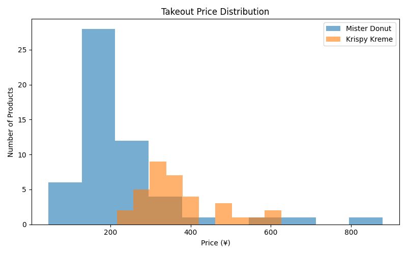

# Donut Price Analysis 🍩

## Overview
This project analyzes takeout prices of donuts from **Mister Donut** and **Krispy Kreme**  
by scraping product data from their official websites and comparing price distributions.

The goal is to understand differences in pricing strategies between the two brands.

---

## Data Collection
- Web scraping using **Playwright**
- Collected product names, URLs, and takeout prices
- Only **single donut products** were included  
  (sets, mini assortments, and dozen boxes were excluded)
- Products without takeout prices were handled as `null`

---

## Dataset
- Mister Donut: XX products
- Krispy Kreme: XX products

---

## Analysis

### Average Takeout Price
- Mister Donut: approximately ¥XXX
- Krispy Kreme: approximately ¥XXX

This shows that Krispy Kreme generally positions its products in a higher price range
compared to Mister Donut.

---

### Price Distribution

- Mister Donut prices are concentrated in the lower range
- Krispy Kreme prices are spread across mid to higher ranges

---

### Price Range Comparison

- The median price of Krispy Kreme is higher
- Krispy Kreme also shows a wider price variation

---

## Technologies Used
- Playwright
- Python
  - pandas
  - matplotlib

---

## Key Learnings
- Handling different page structures is critical in web scraping
- Missing data should be expected and explicitly handled
- Data visualization makes pricing strategies easier to interpret

---

## Notes
This project is for educational and analytical purposes only.
