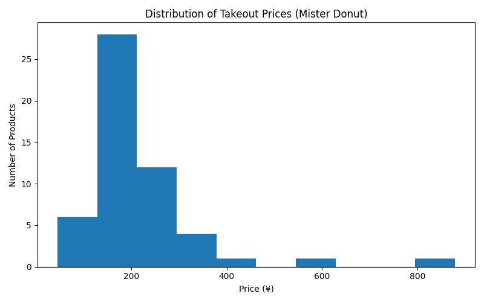

# Mister Donut Takeout Price Analysis

## Overview
This project analyzes takeout prices of Mister Donut products using web scraping and data analysis.
The goal is to understand price distribution and establish a baseline for comparing donut chains.

## Motivation
Many donut chains primarily focus on takeout sales.
To ensure fair comparison across brands, this analysis focuses on **takeout prices only**.

## Data Collection
- Scraped product names and takeout prices from the official Mister Donut website
- Implemented using Playwright (TypeScript)

## Analysis
- Extracted numeric price data from text
- Calculated minimum, average, and maximum prices
- Visualized price distribution and individual product prices

## Results
- Takeout prices are concentrated between XXX–YYY yen
- The average takeout price is approximately ZZZ yen
- A few premium items are priced significantly higher than the average

## Tech Stack
- Playwright (TypeScript)
- Python (pandas, matplotlib)
- GitHub

## Future Work
- Apply the same methodology to Krispy Kreme
- Compare takeout price distributions across donut chains
